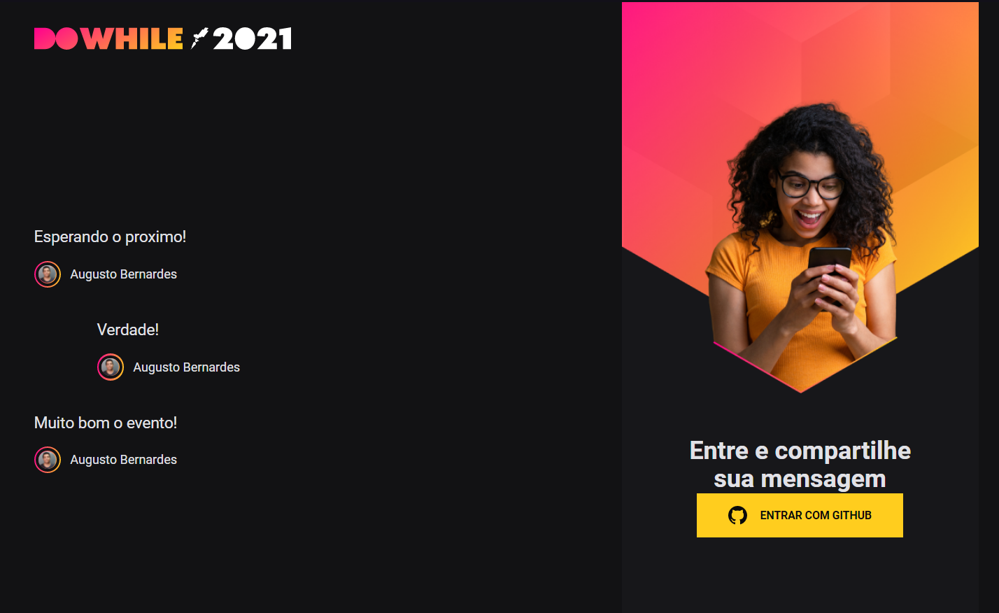

# Nlw-Heat-Front-End
System developed in Rocketseat course, developing a ReactJs application for GitHub login, and socket chat

>Status: Finished ✔️

### That's a System developed on course from [Rocketseat](https://www.rocketseat.com.br), front end of application using GitHub login and a real time chat using socket.io
---
## Sistem functions 
+ Login using GitHub oauth
+ Save messages and show in real time
+ Display last 3 messages
---
## Observations 
+ To dowload the packages use NPM install or YARN 
+ To run the app use YARN dev
+ Don't forget to change the file (.env_example) to (.env )
+ On .env put all your variables 
+ Server will run in localhost !
+ To get GitHub Id's use developer settings
+ Back End is on this [repository](https://github.com/AugustoBernardes/Nlw-Heat-Back-End)
---
## Technologies Used:

+ [ViteJs](https://vitejs.dev)
+ [PostgreSQL](https://www.postgresql.org)
+ [ReactJs](https://reactjs.org)

---
# Dependencies
```bash

  $ yarn add socket.io-client
  
  $ yarn add dotenv
  
  $ yarn add sass
  
  $ yarn add axios
  
```
---
# Preview




<h2 align='center'>author</h2>
<div align='center'>
  Made with ❤️ by <a href="https://github.com/AugustoBernardes">Augusto</a>
</div>


